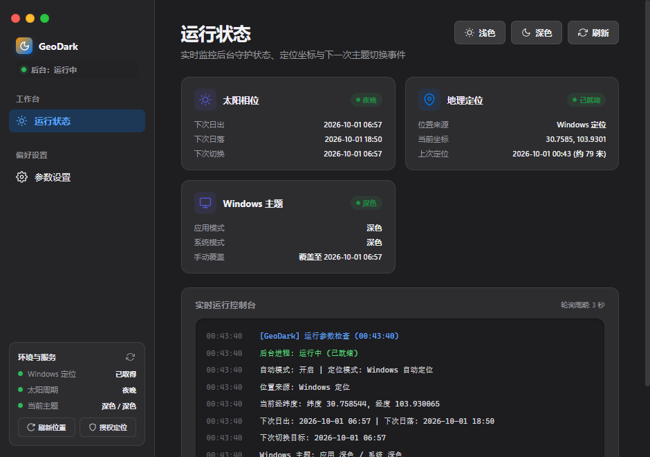
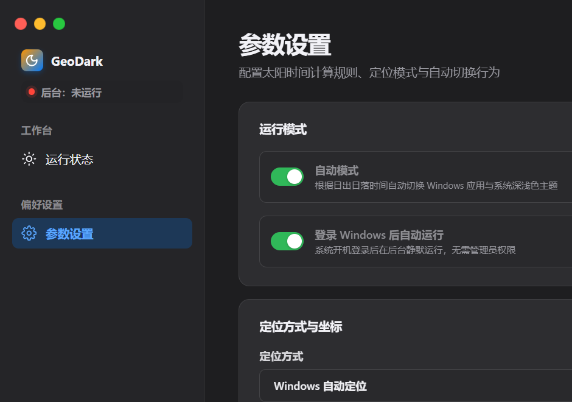
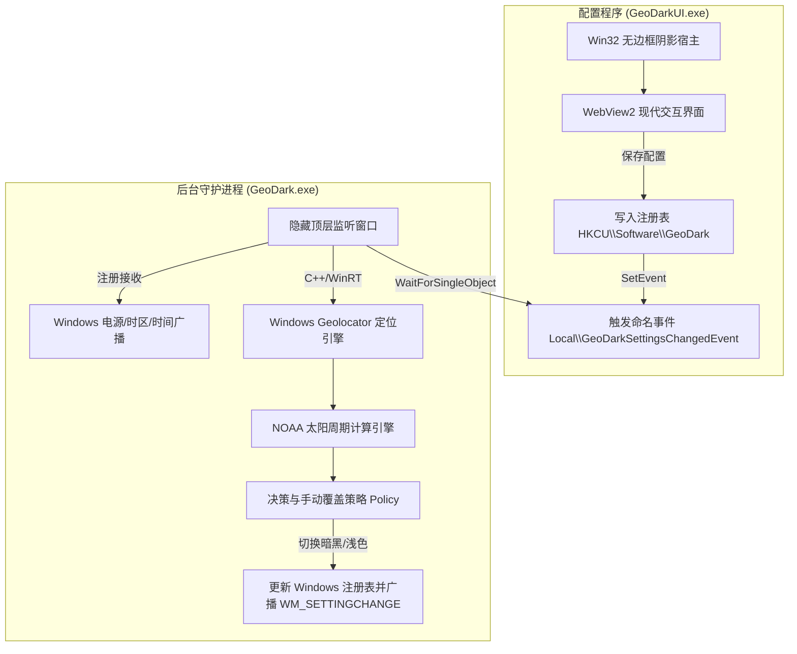

# GeoDark

<p align="center">
  
</p>

<p align="center">
  <b>面向 Windows 11 x64 的轻量、精准、原生自动深浅色主题切换工具</b>
</p>

<p align="center">
  <a href="https://gitlab.com/DerekWangHUZ/GeoDark/-/releases"></a>
  <a href="#"></a>
</p>

---

## 项目简介

GeoDark 是一款专为 Windows 11（兼容 Windows 10 x64）打造的低功耗、免网络 API 依赖的深浅色主题自动切换系统。它基于 Windows 本地定位服务与精确的 NOAA 太阳周期算法，在日出日落时精准自动切换系统与应用程序主题。

配置程序（`GeoDarkUI.exe`）拥有现代化的卡片化视觉交互与 Cascadia Mono 实时诊断控制台，深度适配 Windows 11 高清屏幕与暗黑模式。

| 运行状态与实时终端控制台 | 参数设置与智能联动 |
| :---: | :---: |
|  |  |

---

## 核心特性

- ☀️ **全本地天体算法计算**：内置 NOAA 太阳位置计算模型，自动根据经纬度计算真实天文日出日落与晨昏蒙影时间，无需访问任何第三方天气或太阳时间云端 API。
- 📍 **静默感知 Windows 定位**：通过 Windows C++/WinRT 原生位置服务获取设备坐标；在无定位权限或离线时，支持平滑降级至最近有效坐标或手动输入经纬度。
- 🎨 **现代化桌面视觉系统**：
  - 界面风格全面复用现代桌面 UI 设计规范，支持 Fluent 风格红黄绿窗口控制与精细圆角磨砂卡片。
  - 内置 Cascadia Mono 等宽实时控制台，实时滚动输出系统状态与诊断日志。
  - 完整适配系统深色/浅色配色，支持无边框窗口平滑阴影。
- 🖥️ **Per-Monitor V2 高 DPI 锐利光栅化**：内嵌应用程序清单（Manifest）与进程级 DPI 感知注入，在 125%、150%、200% 等高缩放显示器及跨屏拖动时均实现点对点矢量精细渲染，彻底告别位图插值模糊。
- 🪐 **专属定制天体图标**：融合朝阳金辉、弦月夜空、经纬网与罗盘定位点，内嵌 16px 至 256px 完整 Windows 多分辨率图标资源链。
- 🪶 **极致轻量，零冗余开销**：
  - 后台守护进程（`GeoDark.exe`）日常私有工作集仅 ~2MB 至 5MB，基于 Windows 电源/时间广播与单次事件定时器唤醒，无任何常驻自旋轮询循环。
  - 无托盘图标驻留，不注入系统服务，纯粹静默服务。
- 🔒 **保护用户意图（手动覆盖）**：如果在日间临时在 Windows 设置中切换为深色（或夜间切换为浅色），GeoDark 自动识别并保留用户意图，直到下一次日照交界时刻才恢复自动同步。
- 📦 **绿色便携，零运行时打包分发**：配置程序静态链接 Microsoft Edge WebView2 Loader，单文件独立运行，无需安装，无外部 DLL 依赖。

---

## 下载与运行

从 [GitLab Releases](https://gitlab.com/DerekWangHUZ/GeoDark/-/releases) 下载最新发行包 `GeoDark-0.3.1-win11-x64.zip`。

### 系统运行要求

- **操作系统**：Windows 11 x64（或已安装 WebView2 运行时的 Windows 10 x64）。
- **定位服务**：Windows 定位服务（如需自动定位）；首次使用在弹出权限窗口中点击允许即可。

### 快速开始

1. 解压下载的 ZIP 压缩包至任意目录（可写或只读均可）。
2. 双击启动 `GeoDarkUI.exe`。
3. **定位设置**：
   - 默认选择“Windows 自动定位”；若首次使用，在提示时点击“请求定位权限”并在系统弹窗中允许。
   - 亦可选择“手动坐标”并填入所在城市的经度与纬度（如上海：`31.23, 121.47`）。
4. **日照偏移**：根据个人作息设置日出、日落切换的提前或推迟分钟数（范围 -120 到 +120 分钟）。
5. **开机自启**：按需勾选“登录 Windows 后自动运行”（仅在当前用户注册表 `HKCU\Software\Microsoft\Windows\CurrentVersion\Run` 写入启动项，无需管理员权限）。
6. 点击“保存设置”。保存成功后后台守护进程即刻生效，您可以随时关闭配置窗口。

---

## 系统架构与工作原理

GeoDark 采用双进程松耦合协作架构：



详细架构剖析与技术选型请参阅 [架构说明文档 (docs/ARCHITECTURE.md)](docs/ARCHITECTURE.md)。

---

## 隐私、数据与安全

- **完全本地化计算**：地理坐标仅用于本地太阳赤纬、时角及天顶角几何运算，绝不会向任何第三方云端传输。
- **最低权限设计**：执行文件具备 `asInvoker` 清单，无需也绝不申请 Windows 管理员提权。
- **干净持久化**：所有配置保存在当前用户注册表项 `HKEY_CURRENT_USER\Software\GeoDark` 下，卸载时删除该注册表项即可完成彻底清理。

更详尽的安全说明请阅读 [安全策略 (SECURITY.md)](SECURITY.md)。

---

## 本地构建与开发

### 构建先决条件

- **编译器**：Microsoft Visual Studio 2022（MSVC v143+，含 C++ 桌面开发套件）。
- **Windows SDK**：Windows 10/11 SDK（包含 C++/WinRT 投影头文件）。
- **构建工具**：CMake 3.21 或更高版本。
- **可选工具**：Go 1.22+（用于构建应用图标生成脚本 `tools/icon/main.go`）。

### 编译步骤

在 **x64 Native Tools Command Prompt for VS 2022** 或配置好环境变量的 PowerShell 中执行：

```powershell
# 1. 配置 CMake 生成目录
cmake -S . -B build -A x64

# 2. 编译 Release 目标
cmake --build build --config Release

# 3. 运行日照算法自动化测试套件
ctest --test-dir build -C Release --output-on-failure
```

编译产物：
- `build\Release\GeoDark.exe`（后台静默服务）
- `build\Release\GeoDarkUI.exe`（现代化配置界面）

### 代码签名（可选，消除启动安全警告）

Windows 对“带网络下载标记（MotW）+ 未签名”的程序会弹出“打开文件 - 安全警告”。本机开发者可用自带脚本一键签发自建证书并安装信任（首次需要管理员权限）：

```powershell
powershell -NoProfile -ExecutionPolicy Bypass -File tools\sign.ps1 -Dist -Unblock -InstallMachineTrust
```

每次重新构建后 exe 会恢复未签名状态，重新运行该脚本（不带 `-InstallMachineTrust` 亦可）即可。详细说明与手动解除方法见 [常见问题第 7 条](docs/TROUBLESHOOTING.md#7-启动时弹出打开文件---安全警告无法验证发布者)。

### 安装到用户目录（推荐）

开发仓库路径（`...\source\repos\GeoDark\`）可能被系统路径级安全判定标记为 Internet 区域：从这里直接运行会弹出“打开文件 - 安全警告”，`GeoDarkUI.exe` 也会因 WebView2 无法初始化而白屏（实测复现，详见 [常见问题第 9 条](docs/TROUBLESHOOTING.md#9-geodarkui-启动后窗口一片空白白屏)）。构建并签名后请用安装脚本把程序装入用户程序目录，并从那里运行：

```powershell
powershell -NoProfile -ExecutionPolicy Bypass -File tools\install.ps1
```

脚本会将 exe 安装到 `%LOCALAPPDATA%\Programs\GeoDark`、解除锁定、校验签名、把开机自启指向安装目录并启动守护进程。日常使用时让桌面/开始菜单快捷方式指向安装目录的 `GeoDarkUI.exe` 即可。

### 性能测量

项目自带高精度性能采样脚本，用于评测守护进程在设备上的真实资源占用：

```powershell
powershell -File tools\measure.ps1 -Minutes 1
```

输出项包括私有工作集内存均值、最大值、CPU 占用百分比及线程上下文切换频率。

---

## 项目导航与文档

- [版本变更记录 (CHANGELOG.md)](CHANGELOG.md) - 查看各版本特性演进与 Bug 修复历史
- [系统架构文档 (docs/ARCHITECTURE.md)](docs/ARCHITECTURE.md) - 深入了解双进程设计、IPC、高 DPI 与算法实现
- [常见问题与故障排查 (docs/TROUBLESHOOTING.md)](docs/TROUBLESHOOTING.md) - 定位失败、开机自启、DPI 模糊与第三方软件兼容排查
- [贡献指南 (CONTRIBUTING.md)](CONTRIBUTING.md) - 代码规范、编译要求与合并请求流程
- [安全策略 (SECURITY.md)](SECURITY.md) - 安全模型与漏洞报告方式

---

## 项目状态

项目持续迭代中。已知限制与各版本变更记录见 [CHANGELOG.md](CHANGELOG.md)。
